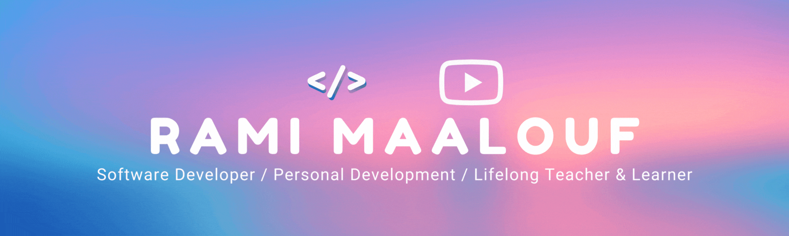

<a href="https://ramimaalouf.tech" target="_blank" rel="noopener noreferrer"></a>

<h1 align="center">Hey there </h1>

🌟 Welcome to my GitHub profile! I'm a passionate explorer driven by a desire to build impactful solutions and share knowledge with the world. I'm particularly interested in the intersection of app/web development and transformative fields like AI, [LLMs](https://en.wikipedia.org/wiki/Large_language_model), [HCI](https://en.wikipedia.org/wiki/Human%E2%80%93computer_interaction), and UX.

🔭 Currently, I am primarily focused on developing [SnipTube](https://sniptube.tech), a browser extension for YouTube, alongside managing [my YouTube channel](https://www.youtube.com/@ramimaalouf) where I offer tutorials and knowledge I gained through my unique experiences

🚀 I’m currently working as a Software Developer Intern at 👁️🐝Ⓜ️, specifically with [IBM Skills Network](https://github.com/ibm-skills-network)

💡 I believe in the power of collaboration and am always on the lookout for exciting projects that make a difference. If you're spearheading an impactful project that seeks to make a difference, I'm eager to explore opportunities to contribute my expertise. You can find/connect with me in the platform of your choice through the buttons below or the links in my profile

## ⚡ Languages and Technologies I use

<div align="center">
  
  
  
  
  
  
  
  
  
  
<!--    -->
  
  
<!--    -->
  
  
<!--    -->
  
  
  
  
<!--    -->
<!--    -->
  
<!--    -->
</div>

<br />

## 📪 Find Me On
<!--   <a href="https://twitter.com/Guibz16" target="_blank"></a> -->
<div align="center" >
  <a href="https://www.linkedin.com/in/rami--maalouf" target="_blank" rel="noopener noreferrer">
    
  </a>
  <a href='https://www.instagram.com/psycho.baller/' target='_blank' rel="noopener noreferrer">
    
  </a>
  <a href='https://medium.com/@ramimaalouf' target='_blank' rel="noopener noreferrer">
    
  </a>
  <a href='https://ko-fi.com/ramimaalouf' target='_blank' rel="noopener noreferrer">
    
  </a>
  <a href='https://www.paypal.com/donate/?business=YAEZW89AZDL6C&no_recurring=1&item_name=Your+support+helps+me+improve+and+grow+my+YouTube+channel+and+the+software+projects+I+develop.&currency_code=CAD' target='_blank' rel="noopener noreferrer">
    
  </a>
</div>
<div align="center">
  <a href='https://open.spotify.com/user/317ip6uskv3ex44es6nsiywa66zm' target='_blank' rel="noopener noreferrer">
    
  </a>
</div>
<!--  <a href="https://medium.com/@th.guibert" target="_blank"></a> -->
<!--
[](https://github.com/psycho-baller/psycho-baller)
-->

<br />

## 📊 Stats

<div align="center">
  
  
  <a href="https://www.youtube.com/@ramimaalouf" target="_blank" rel="noopener noreferrer">
    
  </a>
</div>

<!--div float="left" align="center">
  
   
</div-->
<div float="left" align="center">
  
   
</div>

### This past week I've worked with

<!--START_SECTION:waka-->


**🐱 My GitHub Data** 

> 📦 2.9 MB Used in GitHub's Storage 
 > 
> 🏆 6 Contributions in the Year 2024
 > 
> 💼 Opted to Hire
 > 
> 📜 63 Public Repositories 
 > 
> 🔑 13 Private Repositories 
 > 
**I'm a Night 🦉** 

```text
🌞 Morning                664 commits         ███████░░░░░░░░░░░░░░░░░░   26.69 % 
🌆 Daytime                561 commits         ██████░░░░░░░░░░░░░░░░░░░   22.55 % 
🌃 Evening                616 commits         ██████░░░░░░░░░░░░░░░░░░░   24.76 % 
🌙 Night                  647 commits         ██████░░░░░░░░░░░░░░░░░░░   26.00 % 
```
📅 **I'm Most Productive on Sunday** 

```text
Monday                   456 commits         █████░░░░░░░░░░░░░░░░░░░░   18.33 % 
Tuesday                  332 commits         ███░░░░░░░░░░░░░░░░░░░░░░   13.34 % 
Wednesday                259 commits         ███░░░░░░░░░░░░░░░░░░░░░░   10.41 % 
Thursday                 188 commits         ██░░░░░░░░░░░░░░░░░░░░░░░   07.56 % 
Friday                   216 commits         ██░░░░░░░░░░░░░░░░░░░░░░░   08.68 % 
Saturday                 439 commits         ████░░░░░░░░░░░░░░░░░░░░░   17.64 % 
Sunday                   598 commits         ██████░░░░░░░░░░░░░░░░░░░   24.04 % 
```


📊 **This Week I Spent My Time On** 

```text
💬 Programming Languages: 
TypeScript               7 hrs 31 mins       ███████████████████░░░░░░   76.66 % 
Python                   38 mins             ██░░░░░░░░░░░░░░░░░░░░░░░   06.46 % 
Bash                     29 mins             █░░░░░░░░░░░░░░░░░░░░░░░░   05.09 % 
Markdown                 25 mins             █░░░░░░░░░░░░░░░░░░░░░░░░   04.32 % 
JSON                     18 mins             █░░░░░░░░░░░░░░░░░░░░░░░░   03.06 % 
```

**I Mostly Code in Python** 

```text
Python                   17 repos            ███████░░░░░░░░░░░░░░░░░░   28.33 % 
TypeScript               16 repos            ███████░░░░░░░░░░░░░░░░░░   26.67 % 
Ruby                     1 repo              ░░░░░░░░░░░░░░░░░░░░░░░░░   01.67 % 
Swift                    1 repo              ░░░░░░░░░░░░░░░░░░░░░░░░░   01.67 % 
Jinja                    1 repo              ░░░░░░░░░░░░░░░░░░░░░░░░░   01.67 % 
```


 Last Updated on 10/01/2024 00:54:57 UTC
<!--END_SECTION:waka-->
