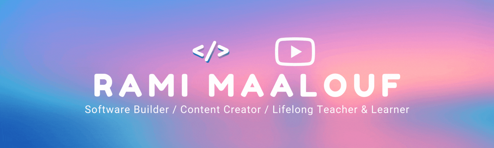

<a href="https://ramimaalouf.tech" target="_blank" rel="noopener noreferrer"></a>

<!--  <h1 align="center">Hey there </h1> -->

I love people... That's all you need to know about me. I love building useful softwares for humans who face the same problem as me and [making content](https://youtube.com/@ramimaalouf) that help them grow. You can learn more about me through [my personal website](https://rami-maalouf.tech).

If you also love people, you need to try out the app I recently launched: [Exo](https://getexo.vercel.app/). Would appreciate [any feedback](https://app.formbricks.com/s/cmbgfzsx80ut7sm01an3v7bz3) to help me plan out Exo's future❤️

## ⚡ Languages and Technologies I use

<div align="center">
  
  
  
<!--    -->
<!--    -->
  
<!--    -->
  
  
  
  
  
<!--    -->
  
  
<!--    -->
  
  
  
  
  
<!--    -->
  
  
  <a href="https://www.tensorflow.org" target="_blank" rel="noreferrer">  </a>
<!--    -->
<!--    -->
<!--    -->
</div>

<br />

## 📪 Find Me On
<!--   <a href="https://twitter.com/Guibz16" target="_blank"></a> -->
<div align="center" >
  <a href="https://www.linkedin.com/in/rami-m" target="_blank" rel="noopener noreferrer">
    
  </a>
  <a href='https://www.instagram.com/psycho.baller/' target='_blank' rel="noopener noreferrer">
    
  </a>
  <a href='https://medium.com/@ramimaalouf' target='_blank' rel="noopener noreferrer">
    
  </a>
  <a href='https://ko-fi.com/ramimaalouf' target='_blank' rel="noopener noreferrer">
    
  </a>
  <a href='https://paypal.me/ramimaal?country.x=CA&locale.x=en_US' target='_blank' rel="noopener noreferrer">
    
  </a>
</div>
<div align="center">
  <a href='https://open.spotify.com/user/317ip6uskv3ex44es6nsiywa66zm' target='_blank' rel="noopener noreferrer">
    
  </a>
</div>
<!--  <a href="https://medium.com/" target="_blank"></a> -->
<!--
[](https://github.com/psycho-baller/psycho-baller)
-->

<br />

## 📊 Stats

<div align="center">
  
  
  <a href="https://www.youtube.com/@ramimaalouf" target="_blank" rel="noopener noreferrer">
    
  </a>
</div>

<div float="left" align="center">
<!--    -->
<!--     -->
   
  
</div>
<div align="center">
  
</div>


<details>
<summary>Click to view the rest of my stats</summary>

<!--START_SECTION:waka-->


**🐱 My GitHub Data** 

> 📦 3.1 MB Used in GitHub's Storage 
 > 
> 🏆 1,027 Contributions in the Year 2025
 > 
> 💼 Opted to Hire
 > 
> 📜 84 Public Repositories 
 > 
> 🔑 25 Private Repositories 
 > 
📊 **This Week I Spent My Time On** 

```text
💬 Programming Languages: 
Other                    48 hrs 30 mins      ███████████████████████░░   90.70 % 
Markdown                 3 hrs 41 mins       ██░░░░░░░░░░░░░░░░░░░░░░░   06.90 % 
TypeScript               53 mins             ░░░░░░░░░░░░░░░░░░░░░░░░░   01.67 % 
Bash                     10 mins             ░░░░░░░░░░░░░░░░░░░░░░░░░   00.34 % 
JSON                     4 mins              ░░░░░░░░░░░░░░░░░░░░░░░░░   00.13 % 
```

**I Mostly Code in TypeScript** 

```text
TypeScript               29 repos            ████████░░░░░░░░░░░░░░░░░   32.22 % 
Python                   20 repos            ██████░░░░░░░░░░░░░░░░░░░   22.22 % 
Swift                    6 repos             ██░░░░░░░░░░░░░░░░░░░░░░░   06.67 % 
Svelte                   3 repos             █░░░░░░░░░░░░░░░░░░░░░░░░   03.33 % 
C++                      2 repos             █░░░░░░░░░░░░░░░░░░░░░░░░   02.22 % 
```


 Last Updated on 07/07/2025 02:14:12 UTC
<!--END_SECTION:waka-->

</details>
